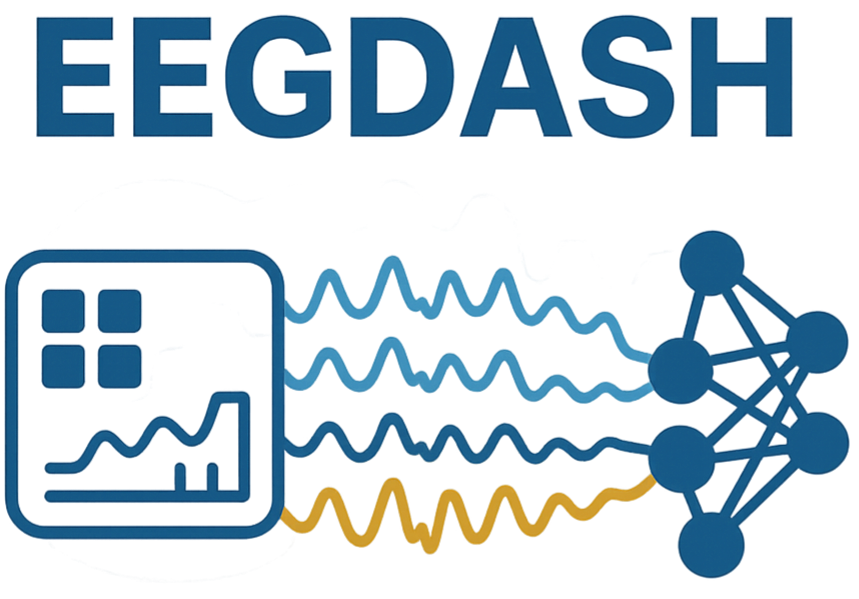

:html_theme.sidebar_secondary.remove:

.. title:: EEG Dash

.. raw:: html

    

EEG Dash Homepage
==================

.. rst-class:: h4 text-center font-weight-light my-4

The EEG-DaSh data archive will establish a data-sharing resource for MEEG (EEG, MEG) data, enabling 
large-scale computational advancements to preserve and share scientific data from publicly funded 
research for machine learning and deep learning applications.

.. raw:: html

    <h2 style="text-align: center;">Institutions</h2>

.. image:: _static/logos/ucsd.png
   :alt: University of California, San Diego (UCSD)
   :class: logo mainlogo
   :align: center
   :scale: 50%

.. toctree::
   :hidden:

   API <api/modules.rst>
   Examples <generated/auto_examples/index>