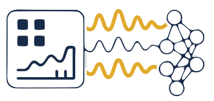

:html_theme.sidebar_secondary.remove: true

EEGDASH Homepage
=================

.. title:: EEG Dash

EEG Dash Homepage
==================

.. raw:: html

   

.. raw:: html

   <h1 class="eegdash-hero__title">EEGDash</h1>

.. rst-class:: h4 text-center font-weight-light my-4
    The EEG-DaSh data archive will establish a data-sharing resource for MEEG (EEG, MEG) data, enabling 
    large-scale computational advancements to preserve and share scientific data from publicly funded 
    research for machine learning and deep learning applications.

.. rst-class:: text-center

    The "DaSh" in EEG-DaSh stands for **Data Share**.

    The EEG-DaSh data archive is a collaborative effort led by the University of California, San Diego (UCSD) and Ben-Gurion University of the Negev (BGU) and partially funded by the National Science Foundation (NSF). All are welcome to contribute to the https://github.com/sccn/EEGDash project.

    The archive is currently still in :bdg-danger:`beta testing` mode, so be kind. 

.. raw:: html

    <h2 style="text-align: center;">Institutions</h2>

    

    

.. toctree::
   :hidden:

   Installing <install/install>
   User Guide <user_guide>
   API <api/api>
   Dataset Catalog <dataset_summary>
   Examples <generated/auto_examples/index>
